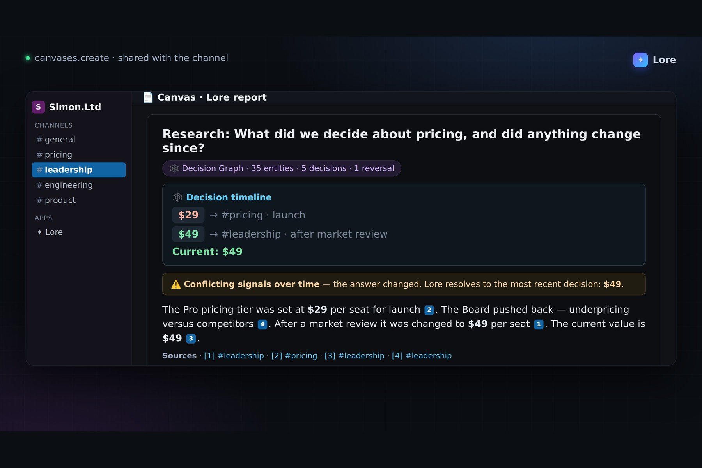
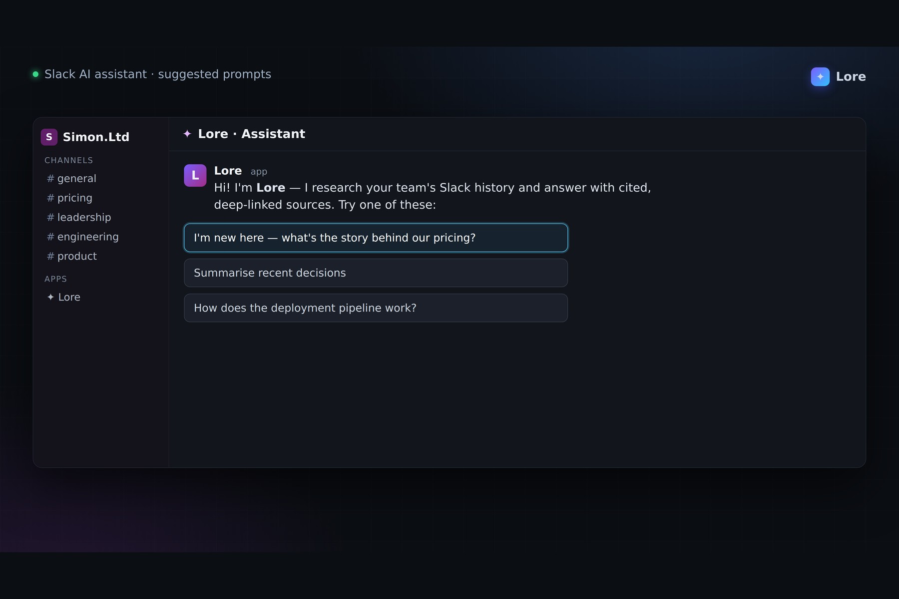
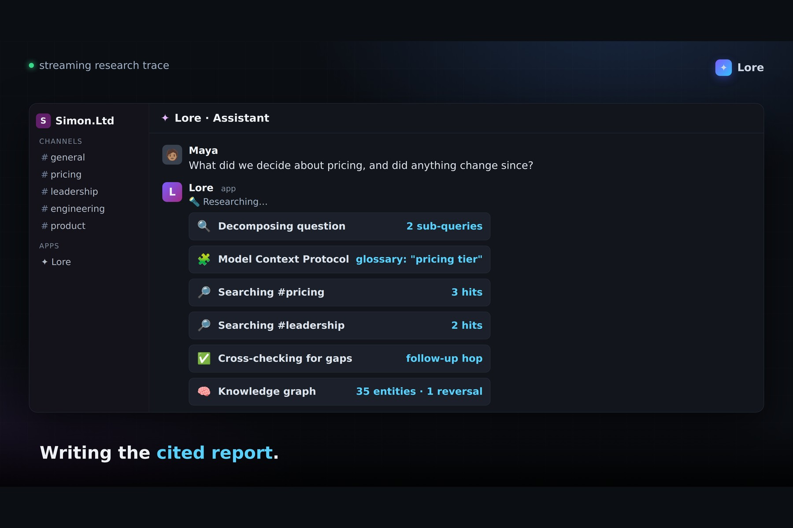
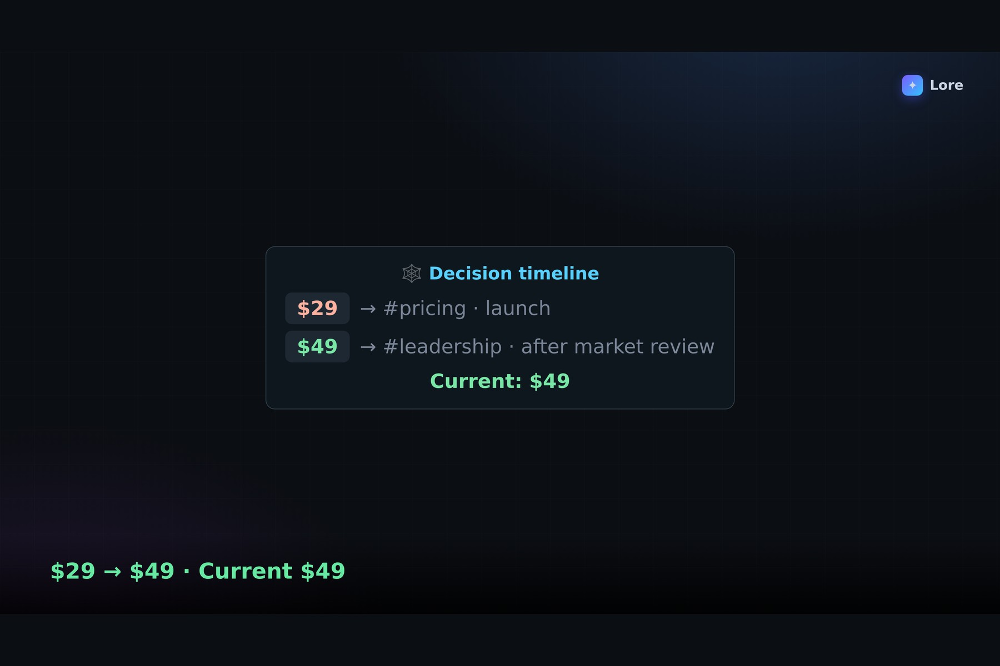
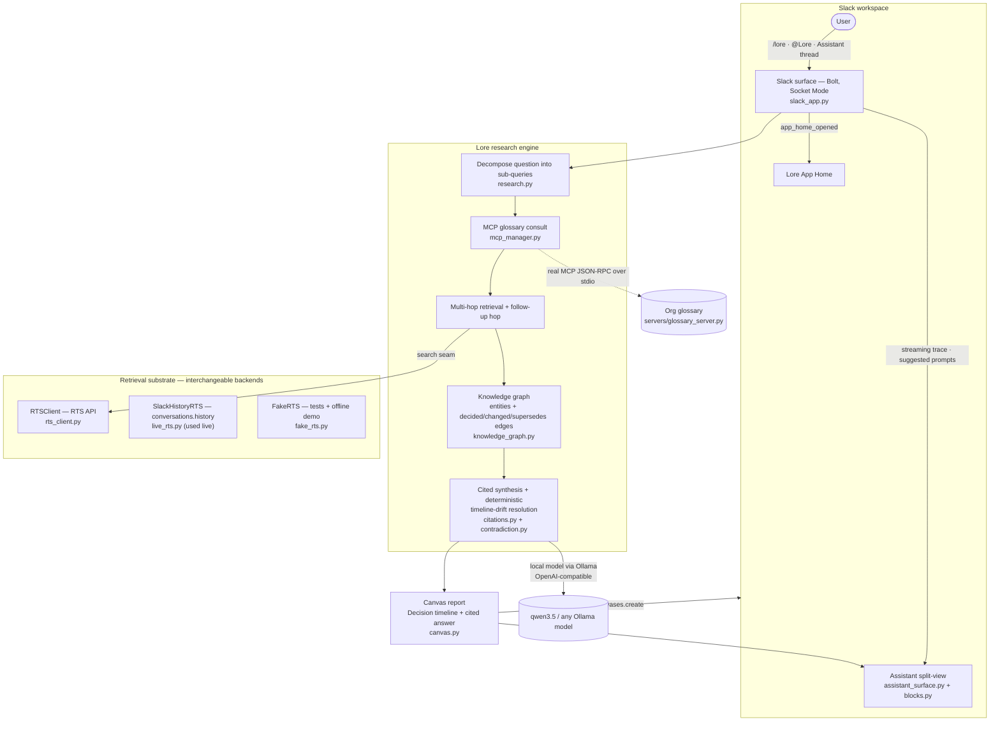

<p align="center">
  
</p>

<h1 align="center">Lore — Deep Research over Your Team's Slack Memory</h1>

Ask a hard question; Lore decomposes it, runs a **multi-hop search** across your channels and threads, builds an ephemeral **knowledge graph** of decisions, resolves contradictions and timeline drift, and answers with **inline citations that deep-link to the exact source messages** — delivered as a **Canvas** report with a **live streaming research trace** in the assistant split-view.

Built for the **Slack Agent Builder Challenge** — track: **Slack Agent for Good**.

## ▶ Demo

[](https://www.youtube.com/watch?v=eQRmRfKLREc)

**▶ Watch the demo on YouTube: https://www.youtube.com/watch?v=eQRmRfKLREc**

A story-driven walkthrough (English voiceover + music) following Maya, a new PM on day 3: she can't find a pricing decision that was quietly reversed, so she asks Lore — which streams its research and returns a cited Canvas showing $29 → $49, every claim deep-linked to its source message. Built from a real live run in the Simon.Ltd workspace. _(The raw file is also in this repo as [`lore-demo.mp4`](lore-demo.mp4).)_

## Screenshots

| The cited Canvas — the reversal, resolved | The Slack AI assistant + suggested prompts |
|---|---|
|  |  |
| **Live streaming research trace** | **Decision timeline from the knowledge graph** |
|  |  |

_More screens in [`docs/gallery/`](docs/gallery)._

## Platform technologies used (all three)

- **Slack AI assistant capabilities** — Lore is an AI Assistant app: assistant split-view container, `assistant_thread_started` greeting, suggested prompts, status updates, and a live research trace streamed by editing one message in place as each phase completes (`src/conduit/assistant_surface.py`, `src/conduit/slack_app.py`, `src/conduit/blocks.py`).
- **MCP server integration** — a real MCP client→server round-trip over the official `mcp` SDK: `servers/glossary_server.py` is a FastMCP server exposing an org glossary; `src/conduit/mcp_manager.py` is the stdio client. The research loop performs a genuine `initialize → tools/list → tools/call` handshake to resolve domain terms before searching.
- **Real-Time Search API (as an interchangeable seam)** — `src/conduit/rts_client.py` defines the RTS-shaped `search(query) -> [SearchHit]` substrate. Because the RTS API is currently allowlisted, live retrieval runs through the interchangeable `SlackHistoryRTS` backend (`conversations.history` indexing + lexical/recency ranking, `src/conduit/live_rts.py`) behind the same seam — the pipeline runs on real workspace data today and swaps to the official RTS API by replacing one class.

## Architecture



## Quickstart (offline — no Slack, no GPU)

```bash
python -m venv .venv && .venv/bin/pip install -e ".[dev]"
.venv/bin/python -m pytest -q              # 154 passing, fully offline
.venv/bin/python scripts/run_demo.py       # the money-shot over a seeded corpus
```

`run_demo.py` seeds a fake corpus containing a genuine pricing reversal, runs the **real** pipeline end-to-end, prints the cited answer plus the knowledge-graph decision timeline, and writes `demo_output.json`. (The `demo_output.json` checked into the repo is a sample of that output — it is regenerated on every run.)

## Run it live in Slack

1. **Install the app** from `manifest.yaml` at [api.slack.com/apps](https://api.slack.com/apps) → *Create New App → From a manifest* (Socket Mode — no public URL needed).
2. **Configure env** — copy `.env.example` to `.env` and fill in:
   - `SLACK_BOT_TOKEN`, `SLACK_APP_TOKEN`, `SLACK_SIGNING_SECRET`
   - `OLLAMA_API_BASE`, `LORE_MODEL` — the local model used for decomposition + synthesis
   - `LORE_CHANNELS` — channels to index (or leave unset to auto-index every channel Lore is in)
   - `LORE_MCP_GLOSSARY=1` — enable the MCP glossary round-trip during research
3. **Seed a demo story** (optional): `.venv/bin/python scripts/seed_corpus.py` creates demo channels and posts a real decision arc — including a pricing reversal — then prints the `LORE_CHANNELS` line to paste into `.env`.
4. **Start Lore**: `python -m conduit.slack_app` — or run `scripts/live_smoke.py` for a one-shot live end-to-end check (index → research → Canvas → post).

**Use it**: `/lore <question>`, mention `@Lore` in a channel, or open the **Lore** assistant split-view and click a suggested prompt.

**Keep it always-on:** to run Lore as a background service that survives logouts and reboots (e.g. during a judging window), see **[`deploy/`](deploy/README.md)** — a one-command systemd user-service setup.

## How it works

- **Decompose** — the question is broken into focused sub-queries by the local model (`research.py`, model client in `agent.py`).
- **MCP glossary consult** — domain terms and acronyms are resolved via a real MCP stdio round-trip before searching (`mcp_manager.py` ↔ `servers/glossary_server.py`).
- **Multi-hop retrieval** — sub-queries fan out across channels through the RTS-shaped seam, with a follow-up hop when coverage looks thin; hits are deduplicated (`research.py`, `rts_client.py`, `live_rts.py`, `dedup.py`).
- **Knowledge graph** — evidence is distilled into entities and typed `decided` / `changed` / `supersedes` edges (`knowledge_graph.py`).
- **Deterministic conflict resolution** — contradictions and timeline drift are resolved from timestamp-ordered evidence, not model prose, so a reversed decision always surfaces with the current value (`contradiction.py`).
- **Cited synthesis and delivery** — the answer is grounded in citations that deep-link to the exact source messages, written to a Canvas with a decision timeline, and streamed as a live research trace in the assistant view (`citations.py`, `canvas.py`, `assistant_surface.py`, `blocks.py`).

## Why this is an Agent for Good

Institutional knowledge shouldn't be a privilege of the tenured. The veteran knows where the decision thread is buried; the new hire, the volunteer, the contributor who joined last week does not — and often doesn't even know who to ask. Lore gives every newcomer the veteran's answer: instant, cited, and traceable to the original conversation. That is knowledge equity, and it means mission continuity survives churn. The assistant's first suggested prompt is literally *"I'm new here — what's the story behind our pricing?"*

## Judge access

The app runs in the **Simon.Ltd** sandbox workspace. Access will be granted to **slackhack@salesforce.com** and **testing@devpost.com**.

## License

MIT
